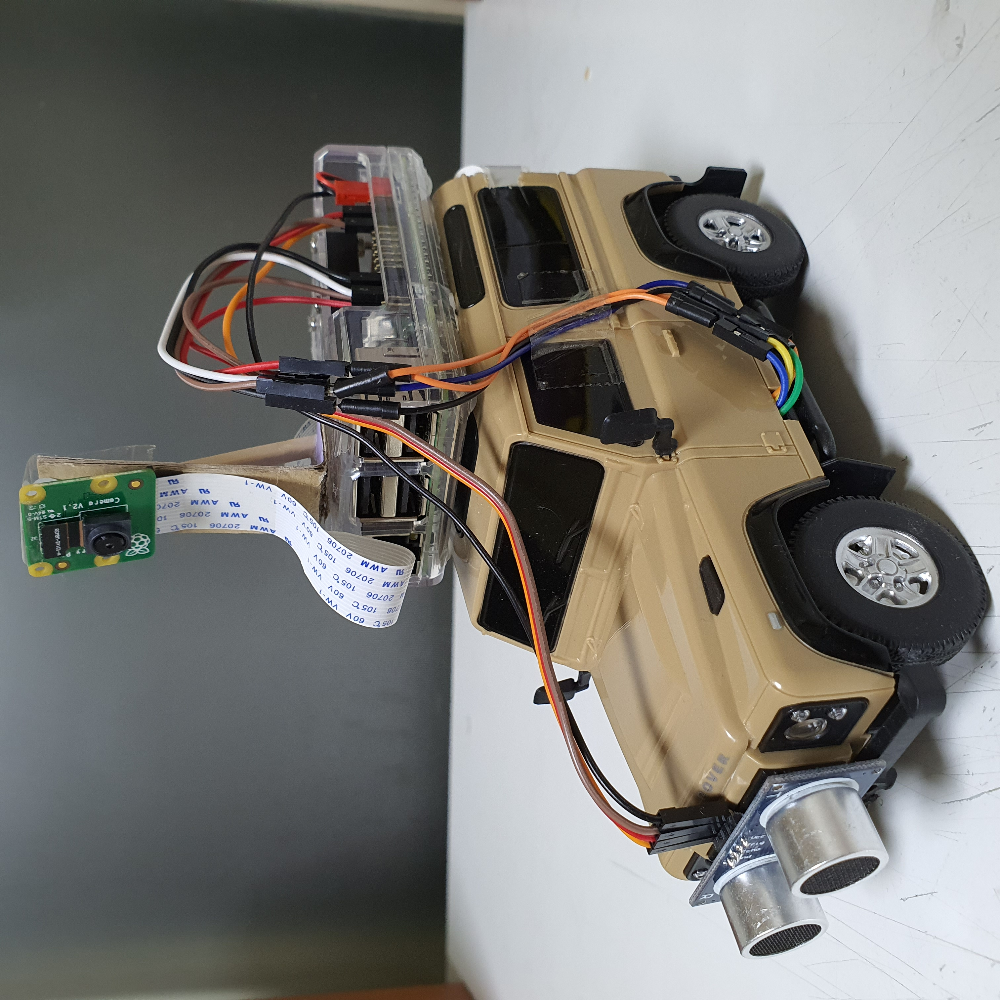
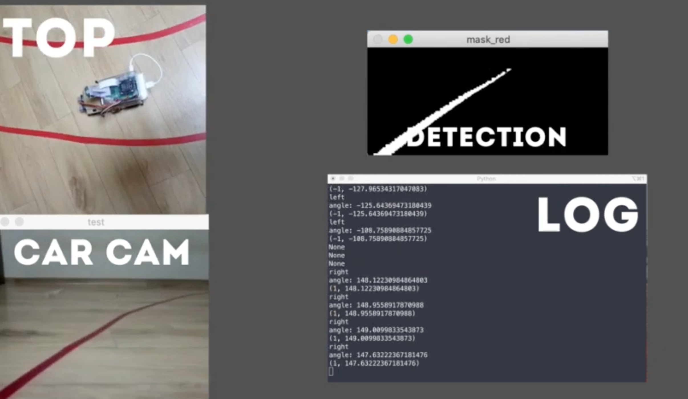

# auto-driving-rccar

[Notion Link ✈](https://www.notion.so/Gangyeon-Jo-s-Portfolio-07db7894fda84255953a50945709f046?p=eaaee942f82b44e6a1a9cfe24342230f)

    

## Video

    

 

## Tech Stack

-   **통신**
    -   socket 기반 오픈소스 라이브러리 [imagezmq](https://github.com/jeffbass/imagezmq)
-   **rc카 제어**

    -   Raspberry Pi 3B + Model
    -   Raspberry Pi GPIO
    -   Raspberry Pi 카메라 모듈
    -   모터 드라이버
    -   초음파 센서

-   **연산**
    -   도로 라인 검출 및 각도 연산: OpenCV
    -   자동차, 정지 표시판 감지: yolov3-tiny model
